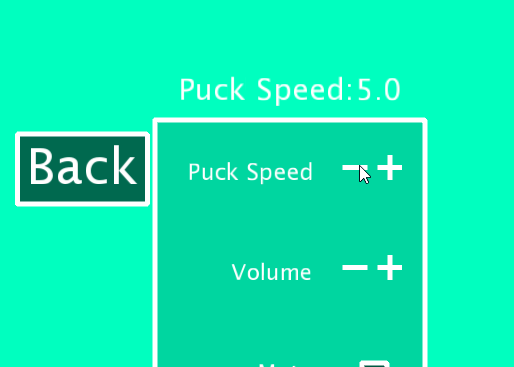

# Music Visualiser Project

Name: Matiss Priednieks

Student Number: C19340106

## Instructions
- Fork this repository and use it a starter project for your assignment
- Create a new package named your student number and put all your code in this package.
- You should start by creating a subclass of ie.tudublin.Visual
- There is an example visualiser called MyVisual in the example package
- Check out the WaveForm and AudioBandsVisual for examples of how to call the Processing functions from other classes that are not subclasses of PApplet

# Description of the assignment
- This assignments prompt was as such: "Something beautiful to enjoy while listening to music."
- I first had planned to create multiple visuals to switch between, with some amount of user interactivity. 
  However, I changed my mind as I figured it would be more interesting and beneficial to learn how to create a functional game.
  I decided on creating the game pong with interesting and aesthetically pleasing visuals, and a main menu system with functional
  settings menus and a song selection menu. I was also going to create another game on top of this, however, I decided to instead polish
  and refine what I already had.

# Instructions
- When the game is launched, you will be greeted by a main menu screen with 4 buttons on it: Play, Songs, Settings and Exit.

- Play: This will start the game of Pong and start playing whatever music is selected, and by default will play "Everybody Wants to Rule the World"

- Songs: This will go into a menu where you can select 3 songs: Everybody Wants to Rule the World, At Dooms Gate and Hero Planet. Only one can be selected at a time.

- Settings: This will bring you to a settings menu where you can adjust a few variables in the game, such as the puck starting speed and it's speed increase after each paddle hit. Can also change volume and mute the music.

- Exit: Exits the game.

# How it works
### The Menu System
This assignment works as such: There is one "main" class called Pongrave which is the control hub for the menu system and the pong game functions.
When the program is first opened, it calls on a switch statement inside of the draw function, this switch statement controls what is actually being displayed.
For example, case 0 (the default option) calls on the main menu.
```Java
            case 0:
                //displays the main menu and pong logo
                pushMatrix();
                noSmooth();
                imageMode(CENTER);
                noTint();
                image(menuimage, width/2, height/11, 200, 200);
                popMatrix();
                
                //big pong logo in the back, faded
                pushMatrix();
                noSmooth();
                imageMode(CENTER);
                tint(255, 100);
                image(menuimage, width/2, height/2, 1000, 1000);
                popMatrix();
                mn.render();
                bttn1.button();
                bttn2.button();
                bttn3.button();
                bttn4.button();
                getAudioPlayer().loop();                    //loops song if it ends
                getAudioPlayer().setGain(gainvaluesong);    //sets volume to desired volume or mutes
                break;
```
When the case is 0 it will display the main menu as well as it's buttons, and calls on the button class to display them.
There are 5 if statements above the switch case that check the users input and if a button is pressed:
```Java
if(mousePressed == true && mouseX < bttn1.buttonloc.x + bttn1.buttonsize.x/2 && mouseX > bttn1.buttonloc.x - bttn1.buttonsize.x/2 && mouseY < bttn1.buttonloc.y + bttn1.buttonsize.y/2 && mouseY > bttn1.buttonloc.y - bttn1.buttonsize.y/2 && check == 0)
        {
            check = 1;
        }
```
This being the if statement for the first button, where if it is clicked it will activate the first case.
Case 1, 2, 3 and 4 work like this, and you are able to return to the main menu by pressing M.
```Java
        if(checkKey('M'))
        {
            p.playing = false;
            check = 0;
        }
```

### Pong
The game works by rendering a sphere for the puck and two boxes for the paddles. The puck speed is controlled by a variable that can be adjusted in the settings menu.
When the puck collides with either paddle it will bounce the opposite direction than that with what it hit the paddle with. There is also a maximum speed allowed for the puck, as at a certain speed the puck
would fly past the paddle. This limit is also enforced in the settings menu so that the player cannot break the game unintentionally.
```Java
                if(speedx < 14 || speedx > -14)
                {
                    speedx *= -Pongrave.speedincrease; //reverses direction of puck and multiplies by the user selected multiplier
                }
                if(speedx > 14 || speedx < -14)
                {
                    speedx = -14;
                }
```
At this point, it also increases the pucks speed by a tiny amound (or large amount) to make the gameplay
a little bit more exciting and fast-paced. This resets when someone scores.

The puck also bounces when hitting the top or bottom walls. Every bounce (including bouncing off of the paddle) plays a quick table tennis ball sound that was sampled online ([Copyright free sound bits](https://freesound.org/search/?q=pong))

#### Pongs Background
The background in my game is simply a massive rotating sphere that the camera is inside (rotates based on music) and two rectangles to act as "tables". All colours react based on the music playing, and are pastel themed.
On each side, there is a little image that I drew in photoshop that displays the controls for each player. 


- Left side shows W and S


- and right side shows the up and down arrows.


- Pong image is in the background during the main menu, as well as being the logo there

### Song Menu
The song menu works by checking a variable, and changing this variable based on if a user has clicked on one of the tracks. 
It uses an if statement that checks the buttons name, and then if the button is pressed it changes the song number to that buttons allocated number.
```Java
        if(songname == "Rule The World")
        {
			Pongrave.colorMode(HSB);
            if(Pongrave.songnum == 1)
            {
                Pongrave.fill(0, 145, 255);
            }
            if(Pongrave.songnum != 1)
            {
                Pongrave.fill(0, 0, 255);
            }
            if(Pongrave.mousePressed == true
            && Pongrave.mouseX < songbuttonx + hitbox.x/2
            && Pongrave.mouseX > songbuttonx - hitbox.x/2
            && Pongrave.mouseY < songbuttony + hitbox.y/2
            && Pongrave.mouseY > songbuttony - hitbox.y/2 && Pongrave.check == 2)
            {
                Pongrave.songnum = 1;
                Pongrave.loadAudio("RuleTheWorld.mp3");     //if it the song name is clicked in the menu it will load this song.
            }
        }
```
It does this for each of the songs available, and when the current song is selected, the text of that song will turn blue.

### Settings menu
The way the settings menu works is relatively simple, inside of the Pongrave class, multiple settings are created and each are named accordingly. It will then check if the setting is meant to be a checkbox or an iterable setting.
If the setting is a checkbox style setting, it will draw a box, otherwise it will draw a - and a +
When those are pressed, it changes variables associated with that setting in their corresponding classes.

Here's an example of the startspeed - buttons function. It reduces the startspeed by 1 every time it is pressed.
```Java
            Pongrave.pushMatrix();
            if(Pongrave.mousePressed == true 
            && Pongrave.mouseX < minusboxX1 + tickbox.x/2
            && Pongrave.mouseX > minusboxX1 - tickbox.x/2
            && Pongrave.mouseY < minusboxY1 + tickbox.x/2
            && Pongrave.mouseY > minusboxY1 - tickbox.x/2)
            {
                Pongrave.delay(100);
                // makes it so startspeed has a minimum value of 1.
                if(Pongrave.startspeed <= 1)
                {
                    Pongrave.startspeed = 1;
                }
                else
                {
                    Pongrave.startspeed -= 1;
                }
            }
```
This is the check box for the mute setting, when pressed it will get marked with an X to indicate that it is active.
```Java
if(muted)
            {
                Pongrave.fill(255);
                Pongrave.textSize(25);
                Pongrave.textAlign(CENTER);
                Pongrave.text("X", lineboxX2, lineboxY2 + tickbox.x/2.2f);
                Pongrave.gainvaluesong = -99;
                Pongrave.gainvaluesample = -99;
            }
            else
            {
                Pongrave.gainvaluesong = Pongrave.volumelevel-4;
                Pongrave.gainvaluesample = Pongrave.volumelevel;
            }
            Pongrave.pushMatrix();
            if(Pongrave.mousePressed == true
            && Pongrave.mouseX < lineboxX2 + tickbox.x/2
            && Pongrave.mouseX > lineboxX2 - tickbox.x/2
            && Pongrave.mouseY < lineboxY2 + tickbox.x/2
            && Pongrave.mouseY > lineboxY2 - tickbox.x/2)
            {
                if(muted)
                {
                    
                    Pongrave.delay(100); //delay is necessary to avoid mouseclick registering multiple times in one click.
                    muted = false;
                }
                else
                {
                    Pongrave.delay(100); //for example, if this was a print statement without a delay, it would print the statement multiple times in one click.
                    muted = true;
                }
            }
```

Each setting also shows it's current value when you hover over it. This is nice as otherwise you wouldn't know what your volume is set to etc. while also making the screen less cluttered, as it only appears when hovering over the setting.


The code is relatively well commented, and in much more detail than this section as well, however, hopefully this was a good overview of what this program can do and how it does it. The exit function is very simple and simply exits the program when it is pressed.

# What I am most proud of in the assignment

# Markdown Tutorial

This is *emphasis*

This is a bulleted list

- Item
- Item

This is a numbered list

1. Item
1. Item

This is a [hyperlink](http://bryanduggan.org)

# Headings
## Headings
#### Headings
##### Headings

This is code:

```Java
public void render()
{
	ui.noFill();
	ui.stroke(255);
	ui.rect(x, y, width, height);
	ui.textAlign(PApplet.CENTER, PApplet.CENTER);
	ui.text(text, x + width * 0.5f, y + height * 0.5f);
}
```

So is this without specifying the language:

```
public void render()
{
	ui.noFill();
	ui.stroke(255);
	ui.rect(x, y, width, height);
	ui.textAlign(PApplet.CENTER, PApplet.CENTER);
	ui.text(text, x + width * 0.5f, y + height * 0.5f);
}
```

This is an image using a relative URL:


This is an image using an absolute URL:


This is a youtube video:

[](https://www.youtube.com/watch?v=J2kHSSFA4NU)

This is a table:

| Heading 1 | Heading 2 |
|-----------|-----------|
|Some stuff | Some more stuff in this column |
|Some stuff | Some more stuff in this column |
|Some stuff | Some more stuff in this column |
|Some stuff | Some more stuff in this column |

